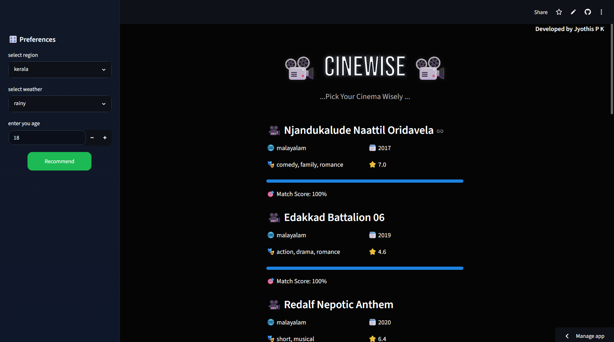

<h1 align="center">
  🎬 CineWise 🎬
</h1>

<p align="center">
  <b>Phase 1</b>
</p>

<h3 align="center">
  Context-Aware Indian OTT Recommendation System
</h3>

**Live Demo:** https://cinewise.streamlit.app

## Overview

CineWise is a context-aware movie recommendation system designed for Indian OTT content. Unlike traditional recommendation systems that rely solely on user watch history or ratings, CineWise incorporates contextual and demographic factors such as region, weather conditions, age group, and movie era preferences to generate personalized recommendations.

The project demonstrates how contextual information can be integrated into recommendation systems to provide more relevant and user-centric suggestions.

---

## Application Preview

<p align="center">
  
</p>

## Features

* Context-aware movie recommendations
* Region-based language preference matching
* Weather-based genre adaptation
* Age-group driven recommendation logic
* Movie era preference scoring
* Dynamic recommendation ranking
* Interactive Streamlit web application
* Responsive dark-themed user interface

---

## Dataset

The dataset consists of Indian movie metadata collected and cleaned for recommendation purposes.

### Attributes

* Movie Name
* Release Year
* Language
* Genre
* Rating
* Votes
* Runtime

### Supported Languages

* Malayalam
* Tamil
* Telugu
* Kannada
* Hindi
* Bengali
* Marathi
* Punjabi
* Gujarati
* Assamese
* Odia
* Bhojpuri
* Others

---

## Recommendation Logic

The recommendation score is calculated using four contextual components:

### 1. Region Match

Maps user regions to preferred movie languages.

### 2. Weather Match

Associates weather conditions with suitable movie genres.

### 3. Age Genre Match

Adjusts recommendations according to age-group preferences.

### 4. Movie Era Preference

Assigns weights to movie release periods based on the user's age group.

### Scoring

Maximum recommendation score: **20**

Movies are ranked according to their total contextual score and the highest-scoring titles are recommended to the user.

---

## Technology Stack

* Python
* Pandas
* Streamlit
* Git
* GitHub

---

## Project Structure

```text
CineWise/
│
├── data/
│   └── cleaned_movies.csv
│
├── notebooks/
│   ├── EDA.ipynb
│   └── testing.ipynb
│
├── src/
│   ├── mapping.py
│   └── recommendation.py
│
├── ui/
│   └── app.py
│
├── requirements.txt
├── .gitignore
└── README.md
```

---

## Installation

```bash
git clone <repository-url>

cd CineWise

pip install -r requirements.txt

streamlit run ui/app.py
```

---

## Future Enhancements

### Phase 2

* Improved ranking methodology using Sentiment analysis
* Recommendation explanations
* Real-time weather API integration
* Movie poster integration

---

## Author

**Jyothis P K**

B.Tech Computer Science and Engineering
APJ Abdul Kalam Technological University (KTU)

---

## Acknowledgement

This project was developed as part of a learning journey in Data Science, Recommendation Systems, and Full-Stack Python Application Development using Streamlit.
